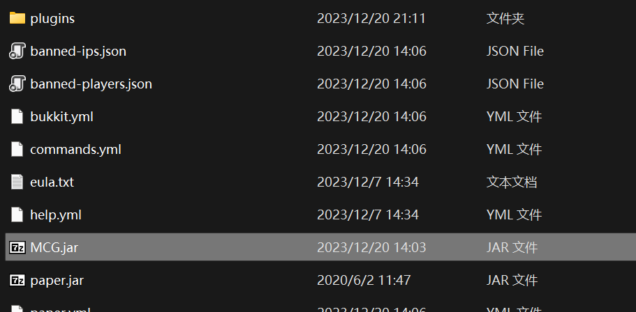

# 控制台模式

## 这是什么

MCGuard的控制台模式是一个独立的程序，它可以在不启动服务器的情况下对服务端中的全部插件进行扫描，并找出潜在的恶意插件。  
控制台模式的优点是：

- 0风险：所有的扫描都不会导致代码被执行，因此哪怕存在插件高度恶意，也不会对您的机器造成任何影响。
- 高速：控制台模式不需要启动服务器，因此扫描速度非常快。
- 轻量：扫描占用的资源非常少，1GB内存可以轻松并行运行数十个扫描进程。
- 简单：控制台模式不需要任何配置，只需要替换服务器核心即可使用。
- 辅助性强：控制台模式拥有非标准模式可供选择。

控制台模式特别适合：

- 一般用户在运行未知来源的服务端前对其进行检查。
- 大量清洗服务端，例如服务端交易者、服务商。
- 对已知存在恶意插件的服务端进行检查。

## 快速开始

要使用MCGuard的控制台模式，您只需要使用MCGuard`替换`服务器的核心。  
如下图所示。再使用标准的命令行，例如`java -Xmx1G -jar MCG.jar`启动MCG即可。  


## 模式选择

当MCG控制台模式完成启动后，您将见到以下字样：

```
[McGuard] 感谢您使用McGuard！
MCGuard v-b0/r0 Author: huzpsb
请选择模式(0-标准模式 1-专家模式 2-开发者模式)：
```

既然您正在翻阅这份文档，请输入0，然后按下回车。

## 结果展示

```
[提示] 正在扫描 MCG.jar ................
[提示] 正在扫描 Vault.jar ................
[提示] 正在扫描 [C]安全测试_CoRE.jar ................

---------------------------------------------------------
[结果展示][C]安全测试_CoRE.jar
[严重] a/x.class 很有可能存在获取OP类后门 (r:set-only)。
[严重] a/x.class 很有可能存在远程命令类后门 (r:processbuilder)。
扫描完成！请按任意键退出
```

对于未检出异常的插件，MCG不会输出“结果展示”块。例如，上文中的MCG.jar和Vault.jar。  
对于存在异常的插件，MCG会输出“结果展示”块。并给出异常的具体描述。  
`请注意，MCG不会对插件进行修改，也不会对插件进行删除。您需要手动删除异常插件。`

## 高级模式注释

三个模式的区别在于：

- 标准模式：使用内置的已知恶意代码对插件进行匹配，能够检出常见的恶意插件。几乎不会误报。
- 专家模式：使用内置的已知恶意代码对插件进行匹配并使用某些规则分析代码的意图，能够检出绝大多数常见的与没有故意规避扫描的恶意插件。存在一定的误报。
-

开发者模式：使用内置的常见代码模板对插件进行匹配，如果不属于常见的代码行为则会报告。能够检出几乎所有的恶意插件。结果仅供人工检查时参考。  
`请注意，开发者模式会输出大量的信息，这些信息对于普通用户来说是没有意义的。设计上，开发者模式仅供在人工检查时缩小范围使用。`

## Pro版本

Pro版本与免费版本的功能没有任何区别。界面、模式、规则库，甚至是客户服务，都是完全一致的。  
Pro版本的优势在于：更快。虽然免费版本的速度完全能够满足普通用户的需要，但是有一些人可能希望使用MCG对大量的服务端进行扫描。  
如果您购买了Pro版本，您将获得一个Pro版本的密钥。您可以通过记事本编辑`mcg.agreement`文件，将密钥填入其中，即可激活Pro版本。  
`请注意，Pro版本的密钥是与机器绑定的，您无法将密钥用于其他机器。请在购买密钥前确保您提供的用户ID是您常用计算机的用户ID。`